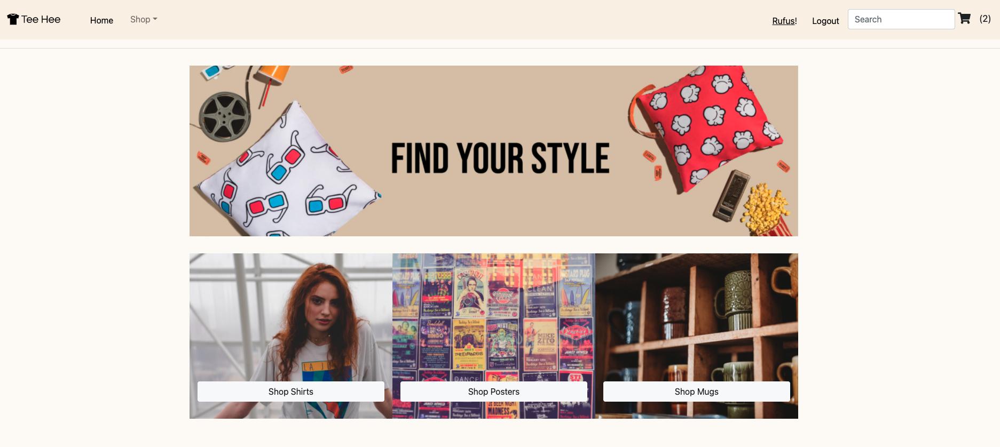
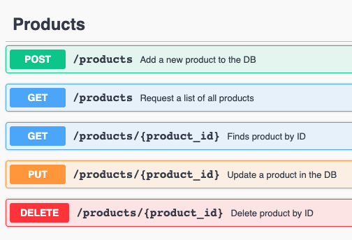
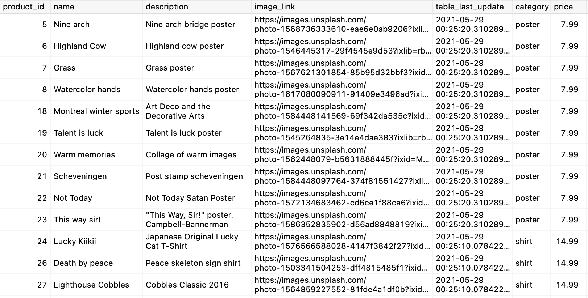

### Client for e-commerce Tee-Hee

This project presents a fully working e-commerce using PostgreSQL, Express, React, and Node.

The app includes a signup/login functionality using Passport.JS
Data encryption is managed through Bcrypt and payments through Stripe.JS

For more detailed information about the API side of the project, either visit the dedicated repository [HERE](https://github.com/vannucci-dev/tee-hee-RESTful-API) or simply by removing the "#" from the url and by adding "/api".

The documentation for the API is managed through Swagger like in the example below:

With insight, this project would have been much easier to manage using Redux instead of Vanilla React, but I wanted to see how effectively I could use React just out of the box.

The database is managed with PostgreSQL with dummy content created by myself.

Here's an example of some products in the DB:

The images are royalty free from unsplash.com.
